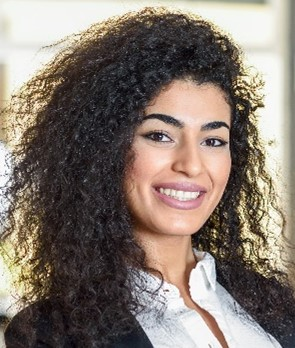
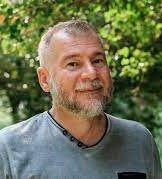

# Personas

O detalhamento do projeto foi realizado a partir da análise de pesquisas e notícias sobre o tópico. Foram utilizados estudos que traçam um perfil acurado dos voluntários no Brasil, tais como a Pesquisa Voluntariado no Brasil de 2021 realizada pelo Datafolha Instituto de Pesquisa e IDIS – Instituto para o Desenvolvimento do Investimento Social.

Tendo como base essa análise, o projeto utilizou a ferramenta das personas para descrever usuários hipotéticos dos produtos a serem construídos. As personas retratam características marcantes do público-alvo, materializando características reais de modo a apoiar a definição das histórias de usuário e dos requisitos da ferramenta.

## Personas

**Nome**: Fábio Oliveira
**Idade**: 35
**Estado civil:** Casado
**Localidade**: São José dos Campos/SP
**Formação**: Administração
**Ocupação**: Analista Administrativo em uma Administradora de Condomínios
**Renda média mensal**: R$ 5 mil
**Mini-bio**: É casado e tem um filho de 7 anos de idade. Bacharel em Administração, trabalha como Analista Administrativo e tem um salário de R$ 5 mil reais por mês. Se considera uma pessoa espiritualizada, mas não segue nenhuma religião específica.
**Motivações e frustrações:** É um amante dos animais e se preocupa com causas ambientais e sociais. Ele acredita que somente com a participação e comprometimento de toda a sociedade haverá uma mudança real no país. Já fez trabalhos voluntários e doações para instituições do terceiro setor no passado, mas devido à falta de tempo não está conseguindo ajudar como gostaria.
**Hobbies**: Atualmente pratica exercícios esporadicamente, mas procura se alimentar bem para que seja um bom exemplo para seu filho. Sua rotina é agitada durante a semana, mas busca reservar seus finais de semana para ficar com a família e reunir amigos em casa. Gosta de manter-se informado e para isso assiste telejornais e acompanha notícias pela internet.  
**Tecnologia**: Utiliza as redes sociais (Instagram) para lazer apenas e para comunicar-se com os amigos e familiares. Porém a rede de comunicação Whatsapp utiliza com grande frequência tanto no âmbito pessoal, como para resolver problemas profissionais. Possui um perfil no Linkedin que não atualiza nem acessa com frequência. Possui um celular da Motorola, com sistema operacional Android.

**Nome**: Mônica Costa
**Idade**: 53
**Estado civil:** Casada
**Localidade**: Salvador/BA
**Formação**: Pedagogia
**Ocupação**: Aposentada
**Renda média mensal**: R$ 3,5 mil
**Mini-bio**: É casada e tem um filho de 27 anos e uma filha de 25 anos de idade, ambos já têm suas próprias famílias e casas. Trabalhou como servidora da rede pública educacional de sua cidade e se aposentou recentemente. É católica e frequenta grupos da igreja, onde faz trabalhos voluntários semanais de distribuição de quentinhas para a população carente da paróquia do seu bairro.
**Motivações e frustrações:** Desde que se aposentou procura algum tipo de hobby ou distração, algo para ocupar seu tempo de maneira prazerosa, mas também que possa ser útil.
**Hobbies**: Pratica atividade física pelo menos três vezes por semana. Não gosta de assistir noticiários, pois acha que as notícias são sempre ruins e tristes.  
**Tecnologia**: Usa Facebook e Instagram principalmente para acompanhar os acontecimentos e olhar como estão amigos e familiares, comunica-se com a família e com seus amigos principalmente pelo Whatsapp, no qual também participa do grupo da paróquia onde as ações e eventos são organizados. Possui um iPhone da Apple.

**Nome**: Luisa Rocha
**Idade**: 29
**Estado civil:** Solteira
**Localidade**: São Paulo/SP
**Formação**: Psicologia
**Ocupação**: Analista de Recrutamento em uma ONG multinacional voltada ao meio ambiente
**Renda média mensal**: R$ 6 mil
**Mini-bio**: Nascida no interior de Minas Gerais, mudou-se com a família para São Paulo quando criança. Estudou em escola pública até o Ensino Médio, e cursou a graduação com financiamento estudantil em uma faculdade particular. Teve alguns empregos durante a faculdade e entrou na empresa atual há 4 anos, tendo sido promovida uma vez há um ano. Está noiva e começando a planejar o casamento. Mora sozinha na periferia da cidade, mas mantém contato próximo com os pais e a família. Seu trabalho é presencial, e leva cerca de 1h para chegar até o escritório de carro.
**Motivações e frustrações:** Gosta de seu trabalho, mas não é apaixonada pela causa. Trabalha em uma função burocrática e há cobrança por mais resultados. Enfrenta dificuldades para progredir na carreira e pensa em mudar de área constantemente.
**Hobbies**: É uma pessoa caseira, gosta de receber os amigos e preparar refeições com todos. Já desenhou por prazer, mas há tempos não o faz. Adora maratonar séries com o namorado e ficar com suas duas gatas em casa.
**Tecnologia**: Utiliza tecnologia desde a adolescência, passa bastante tempo no Instagram e abandonou o Facebook recentemente. Utiliza bastante o Linkedin para contatos profissionais, especialmente por conta de sua função. Sua principal ferramenta de comunicação é o Whatsapp. Possui um celular da Samsung com OS Android.

**Nome**: Laís Caldas
**Idade**: 22
**Estado civil:** Solteira
**Localidade**: Cabo Frio/RJ
**Formação**: Letras - Português
**Ocupação**: Professora de português e Poetisa
**Renda média mensal**: R$ 2,5 mil
**Mini-bio**: É solteira, Bacharel em Letras(PT), trabalha como Professora de Português em uma escola Municipal e tem um salário de R$ 2,5 mil reais por mês. A mesma atua como poetisa, de forma autônoma, e não possui uma religião específica.
**Motivações e frustrações:** É uma amante da arte, dos livros e se preocupa com causas sociais. Se sente abatida quando vê seus alunos sofrendo ataques rascistas e quando nota as dificuldades financeiras de alguns, por conta da alta desigualdade. Deseja ser útil e mobilizar outros ajudar a toda e qualquer criança ou adulto que se encontra em uma situação vulnerável.
**Hobbies**: Escrever poemas, cantar e caminhar.
**Tecnologia**: Utiliza as redes sociais (Instagram) para publicar seus poemas, músicas e para mobilizar as pessoas sobre causas importantes.

**Nome**: Leandro Campos
**Idade**: 55
**Estado civil:** Viúvo
**Localidade**: Governador Valadares/MG
**Formação**: Serviço Social
**Ocupação**: Diretor da ONG "Missão Social"
**Renda média mensal**: R$ 4 mil
**Mini-bio**: É viúvo, Bacharel em Serviço Social, atua como Diretor de uma ONG em Minas Gerais ("Missão Social") e recebe, em média, R$ 4 mil reais por mês.
**Motivações e frustrações:** Ama participar de atividades sociais, por isso tem grande habilidade em relação ao seu trabalho. Após a perda de sua esposa intensificou sua colaboração em causas humanitárias e por isso criou a Organização Social Sem Fins Lucrativos "Missão Social" que ajuda pessoas em situação vulnerável, mediante tragédias e eventos traumáticos. Para o mesmo, um alcance maior das atividades da ONG seria um grande diferencial.
**Hobbies**: Gosta de caminhar ao ar livre e ler.
**Tecnologia**: Utiliza as redes sociais para divulgar os projetos da ONG.

[Retorna](../README.md)
