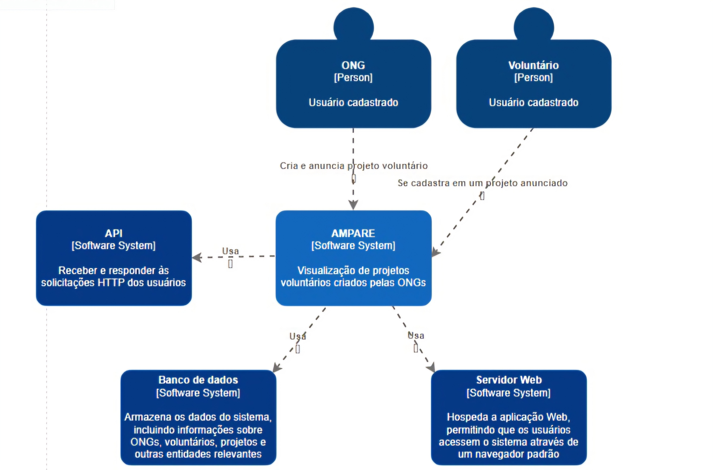

# Diagrama de Contexto

> Esse diagrama apresenta uma visão geral da interação da aplicação arquitetada com o usuário e/ou outros sistemas necessários. A ONG e o voluntário representam os usuários que interagem com o sistema, o projeto Ampare representa a aplicação arquitetada e a API, o banco de dados e o servidor web representam os componentes que interagem com a aplicação. 

